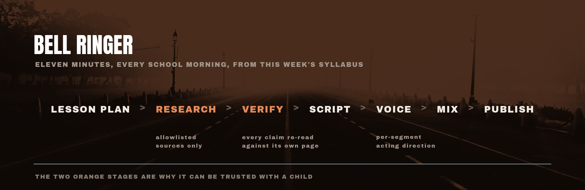

# Bell Ringer

**A daily podcast for the drive to school, built from what your kid is actually
studying this week.**

Eleven minutes. Monday poses the question, Tuesday tells the story, Wednesday
takes the mechanism apart, Thursday argues with it, Friday recaps and quizzes.
Every factual claim is checked against the page it came from before a word is
voiced.

**▶ [Listen to a real episode](.github/media/sample-episode.mp3)** — *Prove the
Earth Spins*, 8:38. Built by this repository from the bundled example
curriculum, from four sources at OpenStax, NOAA and the Library of Congress.
It cost $3.18 and took about twenty minutes. There is no music in it, because
no music ships with this repo — those are the silent breaks.

```
npm install
cp .env.example .env     # add an Anthropic key and an OpenAI key
npm run demo             # one real episode, on your machine, ~$2–4
```

The demo tells you what it will spend before it spends it, uses a bundled
example curriculum, and uploads nothing.

**Using an AI coding agent?** Point Claude Code, Codex, or Cursor at
**[AGENTS.md](AGENTS.md)** and say "set this up for me". It will interview you
first — grade, pronouns, whose voice, where lesson plans come from — then do the
configuration and stop at each step only you can do.

---

## Why it exists

The drive to school is fifteen dead minutes that happen five times a week. A
general kids' podcast is fine, but it is never about the Main Lesson block your
kid is three weeks into. This builds that show, every week, from the syllabus.

The interesting problem isn't generating audio — that part is easy now. It's
generating audio you'd let a child believe. So the pipeline is built around
that constraint:

**A source allowlist.** `config/sources.mjs` is the factuality mechanism. The
research model can reach museums, national labs, universities, and government
science sites — and nothing else. Not a filter applied afterwards; a wall the
fetch cannot cross.

**Claim-level verification.** Every fact the briefing asserts is re-checked
against the page it cites, by a second model whose only job is quote-matching.
Claims that don't verify don't reach the script. This runs on a cheap model on
purpose: it is string comparison, not reasoning, and moving it there took a
week's verification from $9.13 to about $0.40.

**Sources ship with the episode.** Every URL used is listed in the show notes.
If the show tells your kid a number, you can go read where it came from.

## How it works

```
lesson plan ──▶ research ──▶ verify ──▶ script ──▶ voice ──▶ mix ──▶ publish
                     │          │                    │        │
              allowlisted   quote-match         TTS      music +
               sources      every claim       per role   loudness
```

Each stage caches and resumes independently, keyed by content hash. Re-running
after a script tweak costs only what changed.

| Stage | What it does |
|---|---|
| `research` | Reads allowlisted sources, writes a briefing with numbered claims |
| `verify` | Re-reads each cited page, drops claims it can't match |
| `script` | Writes five episodes to a brief that names specific techniques, not "engaging" |
| `voice` | Renders per-segment TTS; roles can use different engines |
| `art` | Duotone episode covers from a source photo |
| `assemble` | Music beds, two-pass loudness normalisation, true-peak limiting |
| `publish` | Uploads audio and manifest to R2 |
| `feed` | Rebuilds the RSS, exposing only episodes whose air date has passed |

That last line is what makes it a daily show. The whole week renders on Sunday
night; the feed is rebuilt each weekday morning and only ever includes episodes
that have aired. Friday's quiz can't be spoiled on Monday.

## What you need

**Required**

- Node 20+, `ffmpeg`, and an [Anthropic API key](https://console.anthropic.com)
- An [OpenAI API key](https://platform.openai.com) for text-to-speech

**Optional**

- ImageMagick — episode artwork; without it you get audio and no covers
- [Unsplash](https://unsplash.com/developers) — cover photography (free tier is plenty)
- [Hume](https://platform.hume.ai) — a cloned voice, if you want the show to open in yours
- Cloudflare R2 + Vercel — only needed to actually publish; the demo needs neither

**Cost.** About **$12 per show per week** at five episodes: ~$10 research, ~$1
scripts, ~$1.60 voice. The research fetch budget is the lever if you want it
lower. `npm run costs` reads the ledger and shows whether caching is working.

## Making it yours

Full walkthrough in **[docs/SETUP.md](docs/SETUP.md)**, or hand
[AGENTS.md](AGENTS.md) to a coding agent. The short version:

Everything about the listener lives in one place — `SHOWS.<id>.listener` in
`config/show.mjs`:

```js
listener: {
  grade: 6,
  age: 'eleven or twelve',
  pronouns: 'they',   // 'he' | 'she' | 'they'
  term: 'kiddo',      // rare direct address; '' for none
}
```

Set `pronouns` and the entire writer's brief agrees, verbs included. It ships as
`they`, which is right for a child whose pronouns you haven't been told and
right for a child who uses it.

The two voice roles are **PARENT** (cold open, welcome, outro) and **NARRATOR**
(the acts) — named for the job, not for who fills it.

1. Put the curriculum in `plans/` — see `plans/example-year.json` for
   the shape, or paste it week by week at `/admin` on the deployed site.
2. Edit `config/show.mjs` — segment timings, per-segment acting direction,
   palette, audio chain, voice modes. Most changes live in this one file.
3. Drop music into `music/{theme,sting,bed}/` and run `npm run music` to sort
   it by measurement. It renders with silent breaks if you skip this.
4. `npm run week grade6` for a whole week.

`pipeline/script.mjs` holds the writer's brief, and it is worth reading before
you change it: it asks for second person, one thing to do in the car, a
reversal, three numbers per act converted into physical sizes, and questions
with a pause after them — rather than asking for "engaging" and hoping.

## Read this before you publish

**[docs/SECURITY.md](docs/SECURITY.md)** covers the threat model honestly,
including where it is weaker than it looks. The two things that matter most:

- **The feed is protected by an unguessable URL, not by authentication.** That
  is a real design decision with real limits. Anyone holding the URL keeps
  access, and rotating the token breaks every subscriber.
- **`SHOW_LISTED` ships as `false`,** which asks podcast directories not to
  index the show. If you are building this from a real child's real timetable,
  think hard before changing that. An unlisted feed serves the family that
  actually listens just as well.

This repository contains no personal data, no real curriculum, and no
credentials. The example plan is invented.

## A note on what this is

This is a personal project I run for my own family, opened up because the
interesting parts — the source allowlist, claim-level verification, writing for
a synthetic voice rather than for the page — seemed worth sharing. Issues and
pull requests are welcome and may sit for a while. It is not a product and
there is no support.

If you build something with it, I would genuinely like to hear about it.

## Credits

The road in the header and social card is
[a photograph by Deepank Aggarwal](https://unsplash.com/photos/gray-asphalt-road-during-daytime-T18RQWiCFec?utm_source=bell_ringer&utm_medium=referral)
on [Unsplash](https://unsplash.com/@a_deepank?utm_source=bell_ringer&utm_medium=referral),
duotoned by this pipeline's own `treat()` — the same treatment every episode
cover gets.

## Licence

MIT — see [LICENSE](LICENSE). The code is yours to do anything with; the name
"Bell Ringer" isn't included, so please ship your version under your own.

Bundled fonts are SIL Open Font License 1.1, with the licence text alongside
them. No music and no photography are bundled — see
[docs/ASSETS.md](docs/ASSETS.md) before adding either.
